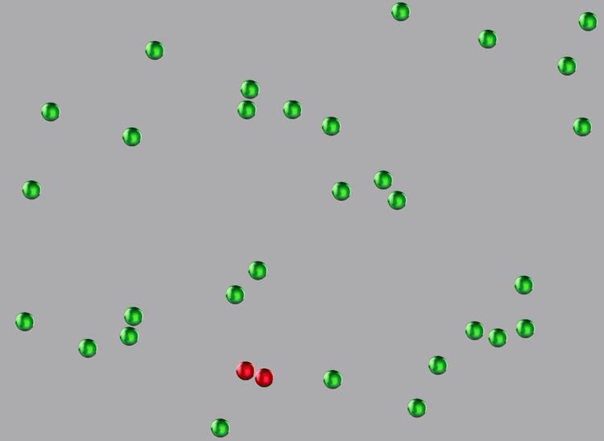

<h2 align="center">Virus Spread Simulation</h2>
<h2 align="center">Apple 2020 WWDC Swift Student Challenge Winner!</h2>

 

The Virus Spread is a simulation which aims to demonstrate the importance of social distancing during a global pandemic. There are colorful balls randomly floating on the screen. They represent people and different colors represent their different statuses: healthy, infected and recovered. When the simulation starts users can observe spread of the virus and tap on healthy balls to put them in a social distancing mode. This way users can see how application of social distancing affects the spread of the virus.

 

The simulation code was created on an iPad using Swift Playgrounds app. I considered different coding approaches and finally settled on SpriteKit since the simulation was similar to a game. This gave me the necessary structure and freedom to create the playground exactly as I wanted it to be. I separated the code into multiple functions and used them later in the main module. I used my knowledge of coding to create my playground and ultimately to illustrate my initial idea of the simulation. I knew this idea, displaying the spread of virus, would not only be fun and educational to create but also informative and educational to the public during these desperate times.

 

Check out the playground code at <a href="https://github.com/a-n-y-a/virus-spread-sim">Anya's GitHub Repository</a>

 

 

 

